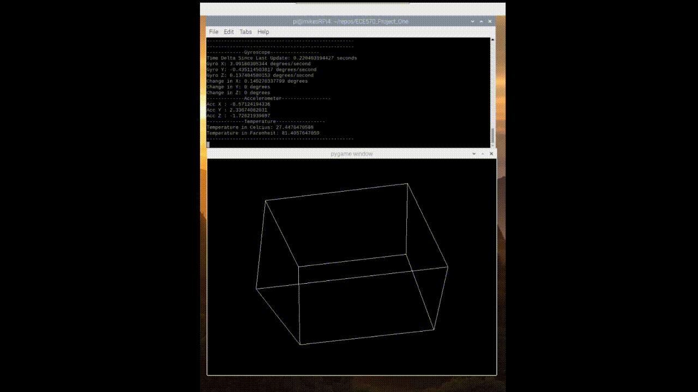

# ECE 570 - Project #1
# I2C Communication with a MPU-6000 Gyro/Accel/Temp Sensor
This repository contains all of the code created within scope of a graduate degree course at the University of Michigan Dearborn. 
The course is known as ECE 570 Computer Networks, and was taken by Michael Bowyer (mbowyer@umich.edu) in the Fall 2021 semester. 

## Hardware Requirements and Connections
This project was desgined and ran on a Raspberry Piv4 hardware with a InvenSense Inc. MPU-6000. The MPU-6000 is a 6-axis MotionTracking device that combines a 3-axis gyroscope, 3-axis accelerometer, and a Digital Motion Processor™ (DMP) all in a small 4x4x0.9mm package. The connection between the Raspberry Pi and MPU-6000 is as follows: 

| Raspberry Pi Pin Identifier         | MPU-6000 Pin Identifier     | Description of connection |
|--------------|-----------|------------|
| 5V (Pin 2 or 4) | VCC | Power |
| GND (Pin 6, 9 or 14) | GND | Ground |
| I2C1 SDA (Pin 3) | SDA | Serial Data Line |
| I2C1 SCL (Pin 5) | SCL | Serial Data Clock |

## Python Environment setup
All work was done using a Python 2.7.16 virtual environment on the raspberry pi. 
```bash
pip install -r requirements.txt
```

## Demonstration and library usage
You can use the mpu_lib.py file as a library to read data from the MPU-6000 into your project. Import this library as follows:

```python
import mpu_lib
```

To run the demonstration which changes the orientation of a virtual cube based on the movement of the MPU-6000, run the below commands. 

```bash
python mpu_gyroscope_visualizer.py 
```


## Contributing
Michael Bowyer (mbowyer@umich.edu)

## License
[GNU GENERAL PUBLIC LICENSE](https://choosealicense.com/licenses/gpl-3.0/)